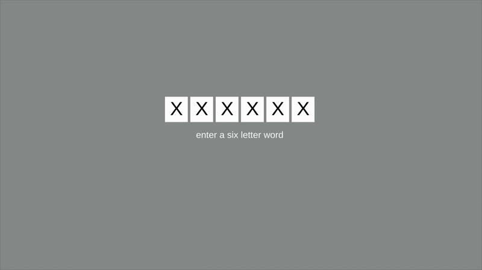

# Process Journal

## 02.19.26 | Initial Idea

Limited access game! Demarcating time by making something only available for a small window every day. Inspired by Han's [Scent of Time](https://www.goodreads.com/book/show/35024337-the-scent-of-time), I want to just explore building an experience that is informed by the idea of daily ritual. 

Obviously this is being informed by both [Ritual of the Moon](https://karastone.itch.io/ritual-of-the-moon) and [Vesper.5](http://mightyvision.blogspot.com/2012/08/vesper5.html) but is different in some important ways. I will do a deeper precedent study on those in the next few days, but the main difference to note is the strict time requirement. In those two games you are encouraged to make it a daily practice, but you can complete your 'task' at any point during the day. I am curious how a forced time-commitment changes the experience. Like the difference between Christian and Islamic requirements for prayer? And is there any benefit of 'punishment' for missing the window? Feels a little to "you lost your streak," but may be worth considering. Maybe there is a building of the experience if you are coming back for the second, third, fourth, etc day in a row. Or maybe it just builds if it's your second, third, yadda, time.

As of now the concept is this: Once a day you have a five-minute (or less? we'll see) window to access a page online that asks you to type in any five-letter word. After you have typed the word, a unique small musical koan is played for you based on your particular combination of letters. You are then invited to come back tomorrow. 

That's it! Super simple, but I think it might be something? At the very least it will be something that I can interact with over a stretch of time and see how I feel about it. There's obviously ways it could get pushed further (are the little songs saved for you to access later? Do they build on eachother? Do you end up with a little word poem music thing after some set number of days?[^1]), but for now I'll try and keep it super narrowly focused.

I think it's important to note that the real impetus here is just to think about time and games in a thoughtful way, and this initial idea may end up not being the way forward. But, a good place to start the exploration I think.

Also to note: LAUTIR is just RITUAL backwards because it needed a name, and I'm an idiot.

## 02.20.26

Built the basic bones of the time-requirement and letter-input aspects of this. Initially, I had planned on a five letter word (probably influenced by Wordle), but when I went to make the gif and was trying to think of what word to use, I realized that six letters would let me use LAUTIR, which feels like a smart move. Also, six letters will give us more musical-control options. 

I'm starting to think about what exactly this _looks_ like upon submission. Do the letters fade away? Do they dance away? Do they drift around to the music? Are they presented one by one to signify what they are contributing to, sonically? Probably relies a bit on what the audio ends up sounding like.

And with that! Next stage is building out the RNBO patch. I could obviously also go with vanilla Unity audio or FMOD, but I think RNBO gives me more granular control and weirder options. Hopefully I will remember how to integrate it all!

## 02.20.24

Discussed this with [Z](https://github.com/zSpaceSheikh), and she/we had some cool thoughts that I wanted to jot down real quick:

* Nature has a history of making us wait (the blooming of the corpse flower, the return of the cicadas, solar eclipses, meteor showers, Haley's comet) and it is always exciting when these come around 
* Similarly, there are times of day/month/year when things align (both in nature and in the built environment) - certain rock formations during the summer solstice, Manhattanhenge
* In general, there is something to be said for _collectively_ waiting for something - live television is an example of this, waiting for a concert to start, the phenomena of [HQ Trivia](https://en.wikipedia.org/wiki/HQ_(video_game)) or Questlove's live DJ sets during lockdown

With this, could there be an alignment on the screen that happens as we get closer to the available time for the interaction? A possible "timer" that doesn't rely on the obvious clock countdown. The visual technique that has already been done with LTHC, IE, and eikon could be used here, but also: the glitcheffects plugin is both a) a bit too cumbersome/wonky in the browser, and b) no longer supported, so possibly making my own shader effects might be the way to go. 

## Notes

[^1]: I actually reallllly like this idea. This also opens it up for being a defined length. Come back for seven days and you get a little thing at the end. Also reminds me a bit of the [A Series of Questions](https://github.com/mouseandthebillionaire/_sonicCharacteristics) project, but shoot me if I ever try and do audio-export from Unity again. Famous last words!
