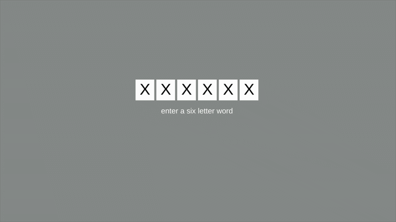
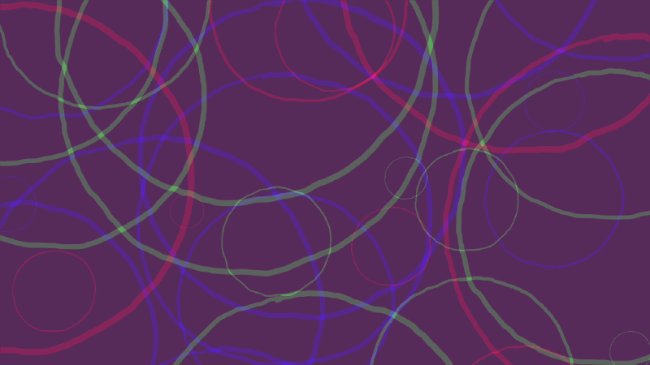
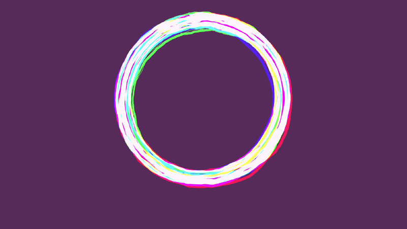
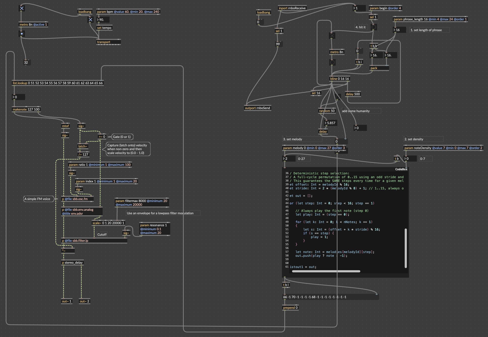
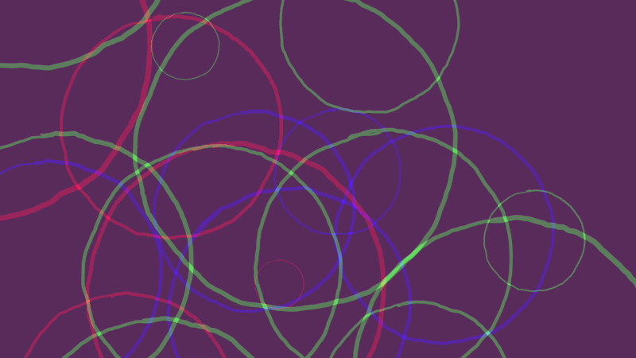
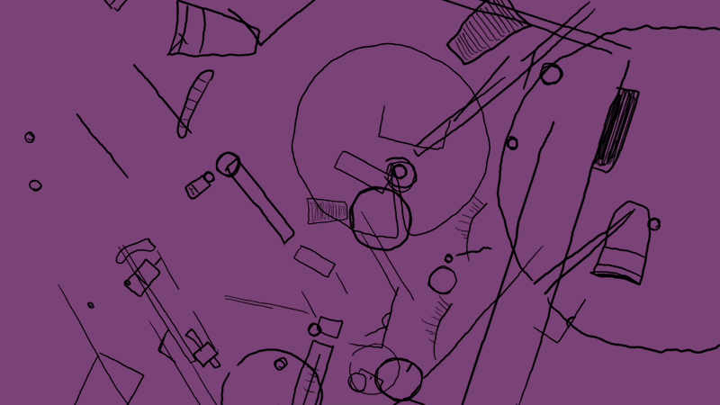
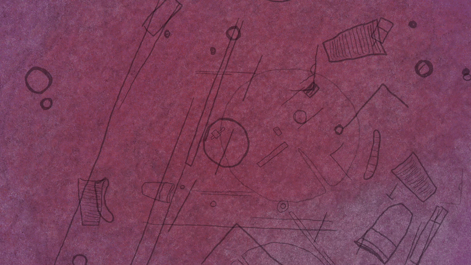

# Process Journal

## 02.19.26 | Initial Idea

Limited access game! Demarcating time by making something only available for a small window every day. Inspired by Han's [Scent of Time](https://www.goodreads.com/book/show/35024337-the-scent-of-time), I want to just explore building an experience that is informed by the idea of daily ritual. 

Obviously this is being informed by both [Ritual of the Moon](https://karastone.itch.io/ritual-of-the-moon) and [Vesper.5](http://mightyvision.blogspot.com/2012/08/vesper5.html) but is different in some important ways. I will do a deeper precedent study on those in the next few days, but the main difference to note is the strict time requirement. In those two games you are encouraged to make it a daily practice, but you can complete your 'task' at any point during the day. I am curious how a forced time-commitment changes the experience. Like the difference between Christian and Islamic requirements for prayer? And is there any benefit of 'punishment' for missing the window? Feels a little to "you lost your streak," but may be worth considering. Maybe there is a building of the experience if you are coming back for the second, third, fourth, etc day in a row. Or maybe it just builds if it's your second, third, yadda, time.

As of now the concept is this: Once a day you have a five-minute (or less? we'll see) window to access a page online that asks you to type in any five-letter word. After you have typed the word, a unique small musical koan is played for you based on your particular combination of letters. You are then invited to come back tomorrow. 

That's it! Super simple, but I think it might be something? At the very least it will be something that I can interact with over a stretch of time and see how I feel about it. There's obviously ways it could get pushed further (are the little songs saved for you to access later? Do they build on eachother? Do you end up with a little word poem music thing after some set number of days?[^1]), but for now I'll try and keep it super narrowly focused.

I think it's important to note that the real impetus here is just to think about time and games in a thoughtful way, and this initial idea may end up not being the way forward. But, a good place to start the exploration I think.

Also to note: LAUTIR is just RITUAL backwards because it needed a name, and I'm an idiot.

## 02.20.26



Built the basic bones of the time-requirement and letter-input aspects of this. Initially, I had planned on a five letter word (probably influenced by Wordle), but when I went to make the gif and was trying to think of what word to use, I realized that six letters would let me use LAUTIR, which feels like a smart move. Also, six letters will give us more musical-control options. 

I'm starting to think about what exactly this _looks_ like upon submission. Do the letters fade away? Do they dance away? Do they drift around to the music? Are they presented one by one to signify what they are contributing to, sonically? Probably relies a bit on what the audio ends up sounding like.

And with that! Next stage is building out the RNBO patch. I could obviously also go with vanilla Unity audio or FMOD, but I think RNBO gives me more granular control and weirder options. Hopefully I will remember how to integrate it all!

## 02.24.26

Discussed this with [Z](https://github.com/zSpaceSheikh), and she/we had some cool thoughts that I wanted to jot down real quick:

* Nature often makes us wait (the blooming of the corpse flower, the return of the cicadas, solar eclipses, meteor showers, Haley's comet) and it is always exciting when these come around 
* Similarly, there are times of day/month/year when things align (both in nature and in the built environment) - certain rock formations during the summer solstice, [Manhattanhenge](https://en.wikipedia.org/wiki/Manhattanhenge)
* In general, there is something to be said for _collectively_ waiting for something - live television is an example of this, waiting for a concert to start, the phenomena of [HQ Trivia](https://en.wikipedia.org/wiki/HQ_(video_game)) or Questlove's live DJ sets during lockdown

With this, could there be an alignment on the screen that happens as we get closer to the available time for the interaction? A possible "timer" that doesn't rely on the obvious clock countdown. The visual technique that has already been done with LTHC, IE, and eikon could be used here, but also: the glitcheffects plugin is both a) a bit too cumbersome/wonky in the browser, and b) no longer supported, so possibly making my own shader effects might be the way to go. 

## 02.28.26 | Alignment Prototype

[Playable Prototype](https://mouseandthebillionaire.github.io/lautir/0.1/)



Spent last week working on the alignment experiment. I repurposed the [eikon](https://mouseandthebillionaire.com/eikon/) circles, and switched the Unity colorspace to additive RBG, so that when they all line up in the middle (as we get closer to the target time) it creates a (mostly) white unified circle. 

As far as the actual playable prototype, it's kind of boring right now? There's just the circles to look at (though the word-entering-UI does appear if you are within the correct minute[^2]) For future versions, maybe it makes sense to have some kind of UI slider so that you can see what it looks like at various points of day? I don't know.



I really like this idea of alignment serving as a visual cue to when the interaction is available. In general, this notion of alignment is super interesting, especially when placed in a non-organic, technological domain. I was surprised when reading the [Manhattanhenge](https://en.wikipedia.org/wiki/Manhattanhenge) Wikipedia page that there wasn't a specific name for this phenomenon, but L did some research which came up with "solar alignment," "collinearity," and, interestingly, "apophenia" (which is the human tendency to perceive meaningful patters, order, or connections in random or unrelated things).

Rudolf Otto's term "numinous" from _[The Idea of the Holy](https://archive.org/details/in.ernet.dli.2015.262513)_ also cropped up in this search which is something that I haven't thought about in a while. Not sure if it's going to play into this piece or the greater PhD ideas, but definitely something to chew on for a bit.

## 03.12.26 | A Week of Words

As mentioned in my [last commit](https://github.com/mouseandthebillionaire/lautir/commit/29deace38821fc53a81ccd4e66e837b54fcacca2), my intention this week was to visit the site every day at noon and enter a word to see how it felt. Total failure. I missed the first day! And then only remembered to do it ONE other day. Obviously this does not bode well for the project, haha. Partially we can chalk this up to a currently boring interaction that doesn't encourage excitement, but also, it's hard to fit something like this in your day. And a five minute window might be too short? ND mentioned [BeReal](https://bereal.com/) as a precedent (which also brings to mind the [Memento Mori](https://petitsmots.app/) app), and these made me think that a push alert might be a good addition. I have no interest in building a dedicated phone app, but I wonder if implementing a .ical file download that sets a reminder for you is a good solution? You could even link out to the page from the event?

So, with all that, I will work on getting that up and running by Monday and try again!

## 03.25.26 | The Week After The Week of Words™️

After spending a week with this I have some thoughts (in no particular order):

As is, this isn't very compelling. Or, should I say, the "entering of the word" part isn't very compelling. The "waiting for the circles to align" part is actually _very_ compelling. Arguably the best part as is. Reflecting on this after the first day made me wonder if it might be worthwhile to randomize the time within a ten-minute window. So the user knows that it will happen sometime between noon and ten-after. You show up at five-till and then have to wait. This might force the hand on the waiting and being present part. As it stands now you can (and I did) easily just have it in the background, and then when the time comes you switch tabs, enter your word, and go about with your day. Not ideal!

As for the music, I had been waiting on the Week of Words™️ to be concluded, but I think we need to charge ahead with this. This (and I'm going to go on a bit of a rant here) made me think a lot about "proper" design process. Proper design process would have me test the idea for the week (as I did) before moving on, but I actually think I should have been working on the music anyway. I guess maybe there's two thoughts here. 1) I know music is going to be a part of this, so why wait? and 2) I kind of have a designer's intuition that'll work out? Obviously things will come up out of the testing, but that could have been incorporated as I wrote the music? Maybe this isn't that compelling of an insight, but it did give me a little crisis in faith as far as how you teach/talk about process. "Just make stuff" should reign supreme, perhaps, over "follow this method"...?

I stored the words as a console message, so I was able to see these, and I think that feels increasingly important. I have experimented throughout the week with putting the words in the background field, which isn't perfect, but it's a step in the right direction. Maybe you can click on the words to hear the song that they produced? Too much overhead!? Too complicated!?

The visuals need to help with the different stages in this. Responding to the word input. Accompanying the musical koan. Storing the word. Recalling the word. Moving through the weeks worth of words. What does it look like when you have started your week? What does it look like when you have ended your week? What does it look like if you skip a day? A lot to figure out here to make this feel like a unified experience.

I realized when I tried to access this on my phone (and another browser) that as-is this will only work if you access it on the same browser every day. I think the only solution to this would be to have a log-in which feels like overkill? Otherwise, just make sure people know to use the same browser? Or check for IP address? Or make it a standalone desktop app (yuck)? Something to think about though.

I think there's more, but for now, let's start working through these.

## 05.11.26 | That Sounds



Picked this up again after finishing a few other projects and trying to get ready for the Game Poems submission. Spent the last two weeks working on the RNBO/Audio portion of this which went well until it hit the inevitable these-things-aren't-connecting-for-some-reason issues.

Long story short, I realized that the [RNBO Unity Integration](https://github.com/Cycling74/rnbo.unity.audioplugin) that I've used previously doesn't work with a WebGL Unity build which isn't great! Claude helped me build a [bridge](../Assets/Scripts/RnboWebBridge) between a RNBO JS export and Unity which is working in this demo.

[Random Melody Demo](https://mouseandthebillionaire.github.io/lautir/melodyTest/)

Now, as for the actual experience/design of the thing: I initially knocked this all together just so I could test the randomized musical phrases (which works!) Hitting space gives you a random melody, note density, and length. I don't _love_ the synth sound right now; the delay is doing a lot of heavy-lifting in keeping it cohesive. I might implement the one from [LTHC](https://www.mouseandthebillionaire.com/lthc/), or I might spend some time tweaking this one so that it is more pleasant. Either way, much more work on the sound side of this before I implement it in the main program.

One random side note (that might be important later): I'm realizing that with the breakdown between RNBO and Unity, Unity is basically unnecessary at this point. As loathe as I am to scrap the whole project and rebuild, it might make more sense to program a completely JS version of this (since it has to be deployed via the web anyway...) Just a thought!

But for now, focusing on sweeting the sound.

## 05.26.26 | That Sounds (Better!)

And now the fun task of trying to convey sonic changes in a visual way! 

Rewrote the synth from scratch and built in polyphony. It's got a real gamey-wamey sound to it right now which I think probably fits the bill. Definitely sounds better without sounding like it's taking itself too seriously. 

I realized as I was working in the Max patch that in general this thing will sound better with looping audio. I liked the idea of each word contributing to a unique musical phrase, but I think it just makes more sense to have them as looping patterns. This opens up the opportunity to have each word responsible for a given "instrument" in the track. 

[Pattern Melody Demo](https://mouseandthebillionaire.github.io/lautir/melodyTest_v2/)

This version randomizes the values of two different instruments. 

```
// Set Phrase Length  
int[] availablePhrases = new int[] { 4, 8, 16, 32 };  
phraseLength = availablePhrases[Random.Range(0, availablePhrases.Length)];  
// Set Note Density  
noteDensity = Random.Range(1, 8);  
// Set Melody  
melody = Random.Range(0, 27);  
// Set Timbre  
timbre = Random.Range(0, 1000);  
// Set Note (RNBO param range 1–4)  
note = Random.Range(1, 5);  
// Set Left Delay  
leftDelay = Random.Range(100, 1000);  
// Set Right Delay  
rightDelay = Random.Range(100, 1000);
```

So far most of these mesh up pretty well together. There might be some cases that we want to specifically avoid, but nothing is too atrocious.

So, moving forward I'm thinking that that two of the words will contribute to these two instruments. One could do a bass line? One could do the overall sonic colour / underlying pad?[^3] I'll start there and see how it feels.

Additionally, talked about this at the MaDe meeting last week, and we discussed other options than the circles. I will implement something that is more of a layered image that reveals itself as it gets closer to the time. Though also I like the idea of the circles being more active and moving around the space when we are further from time, and settling down as we get closer. I will do a prototype of that as well.

Keep it moving!

## 05.27.26 | That Looks... Interesting?

Tried a few different permutations of the alignment prototypes.



Circles on the roam. As they move towards "home" at the designated time, they cease their wandering ways.



Illustrated image drawn over multiple layers becomes aligned as we approach the correct time


Photo split into multiple layers with randomized pixels (the [IE](https://github.com/mouseandthebillionaire/losFinisCDE) and [Eikon](https://github.com/mouseandthebillionaire/eikon) technique) that becomes legible as we approach time.



Both!

## 05.29.26 | Enter Here. Don't Abandon Hope!

[Entering Test](https://mouseandthebillionaire.github.io/lautir/enterTest/)

In order to really get a feel for the core mechanic here (wait some amount of time, enter word, hear some audio that corresponds to the word, \[possibly reflect!]) I built a version that automatically load when you load the page. You still need to wait somewhere between 30-90 seconds, and I think that definitely gets some of the feeling across. I am also enjoying hearing the melody as the circles move from their 'home' location. 

Some thoughts:

- Does the music play all the time once you have entered a word, or is it only for a limited time? Limited time makes it more special, but all the time means you can come back at other times of the day to hear your song. Both have their upsides. The big thing I am seeing now with this choice is that I think there will be radically different UI experiences between the two. Right now the 'enter word, music starts playing as circles leave their alignment' works. But as soon as you have a limited time, I don't think it does. I can imagine an experience where everything fades to black (or just the circles fade out and the background changes) to delineate a _different_ aspect of the experience. Then maybe the words are presented one by one, as the song is built up. Could be more powerful? More ritualistic?
- It's nice hearing the single word's melody, but already I am eager to try a version where you get to a hear a second word. A little bit of backend programming and reorg is required to make that work, so it might not be possible until later next week.

Lastly, feels important to lay out _exactly_ how the word is being mapped to the sounds. As discussed in the MaDe meeting last week, I am assuming that this will be hodden from the user, but it's good to have it noted down for the curious. These are obviously all subject to change, but for now:

- The first letter picks between a phrase length of 32, 16, 8, and 4 notes based on how common the letter is in the English language. Currently this is set as: e t a o i n s r h l d c u m f p g w y b v k x j q z.[^4] e t a o = 32, i n s r = 16, etc
- The second letter controls how dense the music is based on the same commonality index. The less common the letter, the more notes are removed from the phrase.
- The third letter controls the melody. I have pre-written and loaded 25 unique melodies into the Max/RNBO patch, and they are just picked based on the letters alphabet number order.
- The fourth letter maps the timbre on a 0-1000 scale based on the position in the alphabet (letter order * 40) - There is definitely an opportunity here to make qualifying judgments about the letters (the letters that are more round sound less pokey, Z is hella pokey, etc[^5]), but this works for now.
- The second letter also controls the length of the notes (half, quarter, eighth, sixteenth) because it seemed to make sense to line that up with density
- The alphabetical distance between the first and fifth letters and second and sixth letters controls the left delay and right delay, respectively. So as of now, the fifth and sixth letters aren't directly controlling any parameter. Obviously there's room then for even more variety here. But I came up wth this idea of comparing the relationship to different letters within the word as I was writing the code, and that felt like a fun idea to try out.

## 06.18.26

[Song Test](https://mouseandthebillionaire.github.io/lautir/songTest/)

Been working on this a lot, mainly on the music side of things, but not journalling about the process which is my bad. I'm roughly halfway through laying out all of the song structure. This will need a lot of refinement and tweaks in the coming week, but it's sounding pretty good. The version above is music only. Click on the screen, press space, and the song will play (after an annoyingly along delay). You can look at the debug logs to see what instruments are being loaded in what order. Right now the song structure is:

- Initial silence, with music only starting once the first word has been processed
- First word tied to a repetitive chime and pad. First letter loads a unique pad wave file for the given letter. Second letter sets BPM. Third letter sets overall song key. Fourth letter sets the chime timbre. 5th and 6th letters run the delay time (just like in the melody instruments)
- Second word sets the baseline. This works much like the melody.
- Third word does the first melody
- Fourth word sets the second melody

Some issues that need to be addressed:

- RNBO patch triggers the chime on activation. Probably just need to set its volume to zero by default to prevent this
- The long delay is because of the pad being loaded into the buffer. Should probably do this in the background? Maybe we can get the chime to start first while the pad is loading. Once we have the word stored maybe we can even load this as soon as the user gets to the page to stop this delay from happening. It might be unavoidable the first time through though.
- Not sure if the bass should remain the second instrument. Might be better to introduce it after the melodies.
- I think I want to add back in the washy pads we had in the original version. I'll need to rebuild those in RNBO.
- The chime is a bit repetitive. I should script it so that there's a some percent chance of firing the 4th 5th (and 7th?) every so often.
- Eventually I think I want to (per my most recent convo with PB) unbuild the song back to zero so we get a nice little arc. 
- The chime speed is getting changed when the baseline loads for some reason

&&&.*.((.( @.!!.@@ ^^.#.$.#

## 06.22.26 | Song Done

[Song Test (v2)](https://mouseandthebillionaire.github.io/lautir/songTest_v2/)

Got the final song test up and running. Some notes about edits to to the program that went in to this version and thoughts for moving forward:

- I cut the word count (and word letters) to five. There are a few reasons for this change. First, just so I didn't have to figure out a 6th instrument. Second, over the course of making this five-letter words have seemed easier to come up with. And lastly, I think maybe there's something nicer about a five-day experience over a six-day one? Not entirely sure why. Fits in the work week?
- Added back in the washy ambient sounds which also change based on the song key. Might be fun to have these detune all the way to a really deep drone when you are far away from the designated time. 
- I made the final instrument a third melody. It sounds nice, and there doesn't seem to be a need to reinvent the wheel here. So the instruments are chime + pad, bass, melody, melody, melody.
- The five words in the above version are whale, ocean, shark, squid, and coral
- It fades in and out now. It feels a tad long for the full song to play once everything is faded in (just over a minute), but that just might be my testing brain rather than my reflecting one.
- Haven't implemented the variation in the chiming note. Not high priority, but will get around to that if I have the time
- The last letter of the bass doesn't do anything right now. Could be nice to have that tied to the distance between the last letter and the first letter. Maybe be reverb? This would be in similar vein to how the melodies are using delay between the first and last letters so that could be a good correlation.


---
## Notes

[^1]: I actually reallllly like this idea. This also opens it up for being a defined length. Come back for seven days and you get a little thing at the end. Also reminds me a bit of the [A Series of Questions](https://github.com/mouseandthebillionaire/_sonicCharacteristics) project, but shoot me if I ever try and do audio-export from Unity again. Famous last words!

[^2]: 14:24 in this specific version

[^3]: Though the question of how it will feel for the user to enter a word and only hearing a pad being played (if we start with that) is an important one

[^4]: Though it might be worth it to think about how common a letter is for a specific PLACE in the word (i.e the first letter in a word) as noted here: https://mathcenter.oxford.emory.edu/site/math125/englishLetterFreqs/

[^5]: [Bouba/Kiki-style](https://en.wikipedia.org/wiki/Bouba/kiki_effect)

